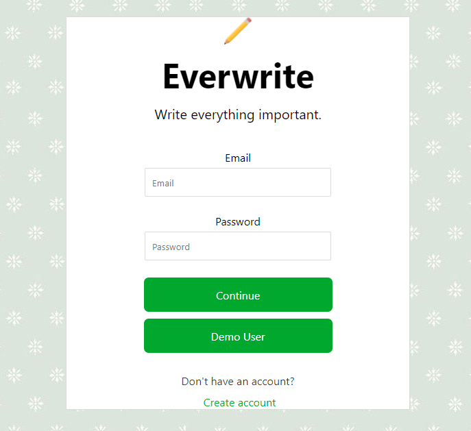
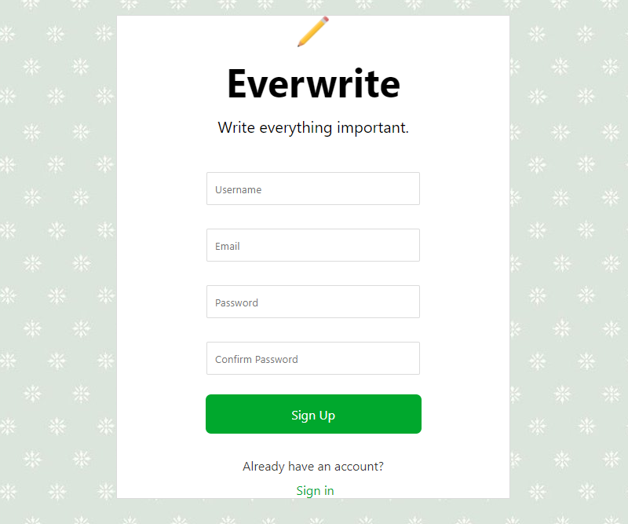
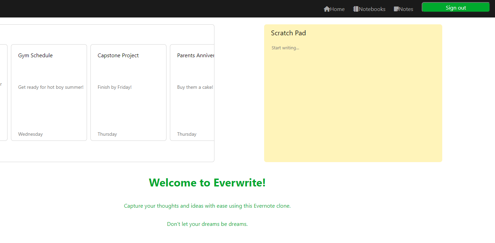
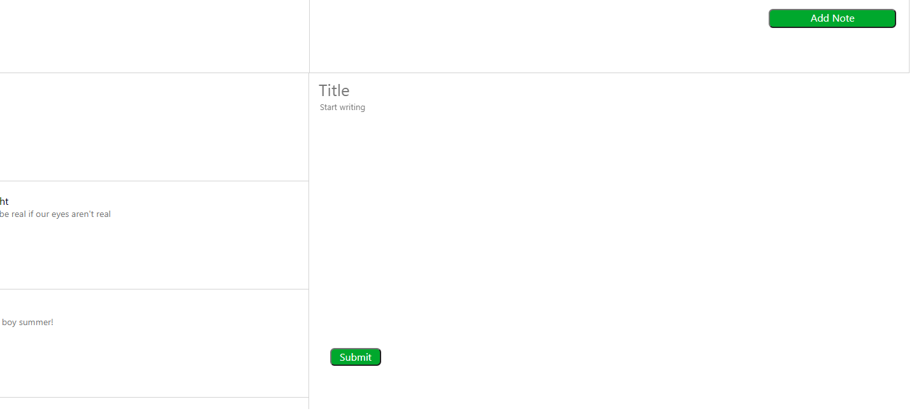
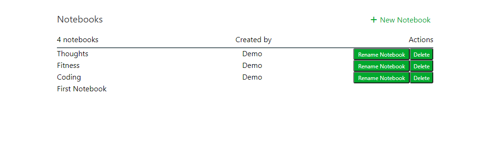

# Everwrite

Everwrite, a full-stack application based off Evernote, is a note taking app that allows users create notebooks and notes to store and organize their thoughts and ideas. There will be more updates to come!

[Visit the site](https://everwrite.herokuapp.com/)

* [MVP Feature List](https://github.com/jchau-623/Everwrite_CapstoneProject/wiki/Feature-List)
* [User Stories](https://github.com/jchau-623/Everwrite_CapstoneProject/wiki/User-Stories)
* [Database Schema](https://github.com/jchau-623/Everwrite_CapstoneProject/wiki/Database-Schema)
* [Frontend Routes](https://github.com/jchau-623/Everwrite_CapstoneProject/wiki/Frontend-Routes)
* [API Documentation](https://github.com/jchau-623/Everwrite_CapstoneProject/wiki/API-Routes)

## Technologies

JavaScript | Python | Flask | React | Redux | HTML | CSS | Node | Postgres | Sequel Alchemy

## Getting Started

1. Clone the project repository
        
        git clone https://github.com/jchau-623/Everwrite_CapstoneProject.git
        
2. CD into the app directory and install dependencies
        
        pipenv install
        
3. CD into the react-app directory and install dependencies
        
        npm install
        
4. Create your .env file based off the .env.example file

5. Setup your PostgreSQL user, password, database, and verify that it matches your .env file

6. Run these commands in order to start your shell, migrate the database, seed the database, and then run the flask app

        pipenv shell

        flask db upgrade

        flask seed all

        flask run
        
7. Open another terminal, CD into the react-app directory and run the React App

        npm start
        
# Features     

## Splash Page

Users can log in with an existing account or sign up and create a new account. There is also a demo option so users can quickly explore the site.
       
</img>
</img>

## Dashboard Page

In the navbar the user can easily navigate to the notes, notebooks, and home page. The dashboard below it presents users with all notes they have made in a horizontal scroll feed. Clicking on the caret will redirect them to the notes page where the user can create, update, and delete any notes they have made. The Scratch Pad is just a convenient area for the user to jot them anything on their mind.

</img>

## Notes Page

Clicking on the add note button will open up a form which allows the user to create notes without a specified notebook. These notes will automatically be put into their "First Notebook" which every user begins with. Clicking on the note on the left hand side of the screen will open a form that allows users to edit their note. The user can scroll through all of their notes here and delete them as well. Displayed on each note is their heading, description, and time the note was created.

</img>

## Notebooks Page

The user can add, rename, and delete all of their notebooks on this page. Clicking on any individual notebook will allow the user to create notes inside that notebook as well as see any other notes in that particulate notebook.

</img>

## In Development

This app still has many features in development, including the ability to share notebooks with other users, upload images, and create tasks with due dates!
